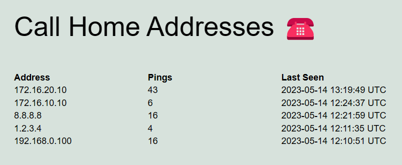

# Callhome

This is a simple service that lets you privately publish your home
router's public IP address on a shared webhost.

It uses two components:

- a PHP script that lives on the server in a folder of your choice
- a systemd service and timer unit which regularly (hourly or whatever)
  calls the PHP script

The PHP script then records the IP address, which corresponds to
your home router, and tracks the number of times the router has sent
requests from a certain address.

The list of IP addresses looks like this, with newest entries first:



## Installing Callhome on Ubuntu

Adjust the URL to be pinged by `curl` (you can also use `wget`),
then:

```
$ nano callhome.service
$ sudo cp callhome.service /lib/systemd/system
$ sudo cp callhome.timer /lib/systemd/system
$ sudo systemctl enable callhome.timer
Created symlink /etc/systemd/system/timers.target.wants/callhome.timer → /lib/systemd/system/callhome.timer.
$ sudo systemctl daemon-reload
$ sudo systemctl start callhome.timer
```

By default, the timer will contact your callhome URL hourly.
